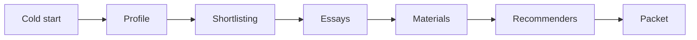

# US Coursework Master's Application Workbench

[中文版本](README.zh.md)

## Product Statement

If you're applying to a US coursework master's program on your own, you're choosing between an expensive, opaque agency and facing dozens of program requirements, shifting deadlines, and contradictory material specs by yourself. This is a set of agent skills that gives you a cross-session application workbench: progress is saved as plain files in a directory you choose, every school-side fact is required to carry a traceable source, and the product hard-stops before you click submit — it never logs in, pays, or submits for you. It ships as agent skills that run inside your own Claude Code or Codex install; there is no hosted service, and your material never leaves your machine.

---

## Overall Flow

Seven stages, from cold start to the application packet, hard-stopping before submission:



---

## Installation

Both runtimes use the same two-step path: add this repo as a marketplace, then install the plugin from it. The four skills ship as one distribution unit — the marketplace entry doesn't list subdirectories, so whatever exists installs together, never half.

### Claude Code

```
/plugin marketplace add jiangxidong/apply-us-masters
/plugin install apply-us-masters@jiangxidong-skills
```

- **How to verify**: the `/plugin` panel shows `apply-us-masters` as enabled; or just say "help me start my US master's application" in natural language and see whether it triggers `apply-us-master`.
- **Snapshot date**: pending re-verification at the new address (tracked in #103).

### Codex

```
codex plugin marketplace add jiangxidong/apply-us-masters
codex plugin add apply-us-masters@jiangxidong-skills
```

- **How to verify**: `codex plugin list` shows `apply-us-masters@jiangxidong-skills` as `installed, enabled`; or trigger with natural language as above.
- **Snapshot date**: pending re-verification at the new address (tracked in #103).

---

## The Four Skills

Mapped one skill per natural product stage — what each skill actually does lives in its own skill instructions. All four skills are built in this repo today.

| Stage | Skill |
|---|---|
| Cold start + profile | [`apply-us-master`](skills/apply-us-master/SKILL.md) |
| Shortlisting | [`pick-programs`](skills/pick-programs/SKILL.md) |
| Essays | [`write-essays`](skills/write-essays/SKILL.md) |
| Materials + recommenders + packet | [`assemble-packet`](skills/assemble-packet/SKILL.md) |

---

## Privacy & Stop-Lines

**One-way valves**: content only flows from this product into your workspace, never back — nothing in your workspace is ever carried back into this product's own repository.

**Ten stop-lines in three categories** (things this product will never do):

- **Actions (6)**: log in for you / upload sensitive files / sign legal declarations on your behalf / pay application fees / click submit / send invitations in a recommender's name.
- **Data (3)**: never read the contents of identity documents / never delete any file in your workspace / never carry anything from your workspace into this product's own repository, rewritten or not.
- **Evidence (1)**: the agent never produces a `✓` line from memory — a `✓` has exactly two legitimate sources: a real fetch of the page body in this session, or a fact and link you supplied yourself. A search-result snippet does not count as a fetch.

**No-read zone**: identity documents are the one file type whose contents are never read — the test is "reading it wouldn't help," not "it's sensitive." Only existence/format checks are performed; contents never enter the model's context.

---

## Acceptance Assets

This repo ships a set of deterministic checks and sample workspaces (under the repo's `evals/` directory) that let anyone reproduce the compliance claims behind the four skills. It's for people auditing this product, not a step in installation — you don't need to run anything there to use the four skills.

---

## Language

The four `SKILL.md` files and this README are maintained in English. ADRs, `docs/`, `CONTEXT.md`, and eval fixtures are maintained in Chinese (engineering-internal).

---

## License

[MIT](LICENSE)
